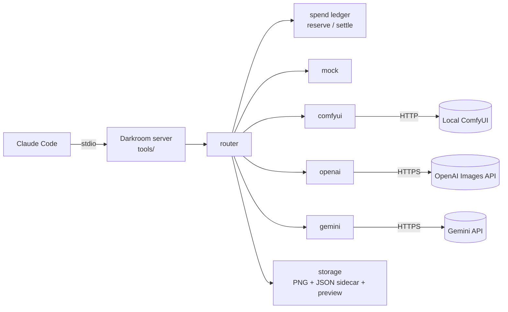
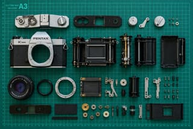

# Darkroom MCP

An MCP server that gives Claude Code an image generation tool. Claude writes the prompt, calls `generate_image`, sees the result, and iterates. Darkroom handles the provider, saves a PNG with a JSON metadata sidecar, and returns a preview Claude can look at.

Providers are swappable: a free local model (Z-Image Turbo via ComfyUI) by default, OpenAI or Gemini as opt-in paid options, and a `mock` provider for tests and demos.

> **Status:** v0.1.0. The `mock`, local `comfyui`, and paid `openai` and `gemini` providers work, with fallback between them, a daily spend cap, and five tools: three for generating and finding images, plus alt text and a WCAG contrast check for images headed into a page. Any provider can base an image on a reference image (M7, awaiting review). It isn't published to npm; install it from source or from a packed tarball (below). See [`SPEC.md`](SPEC.md) for the design.

## How it works



Claude Code starts Darkroom as a stdio MCP server. For each `generate_image` call, the router picks the first healthy provider in `DARKROOM_PROVIDER_ORDER` (or the one Claude was asked to use), reserves the estimated cost in the spend ledger before any paid call, and falls back down the list if a provider fails, but never from a free provider to a paid one unless you allow it. Storage saves the PNG and a JSON sidecar and returns a JPEG preview, so Claude can see the image, critique it, and try again. Each provider is one file behind a small `ImageProvider` interface (`src/providers/`); adding one means that file plus one line in `registry.ts`.

## Quick start (mock provider)

Requires Node 22.12 or newer.

```sh
git clone https://github.com/Matthew-Nelson/darkroom-mcp.git
cd darkroom-mcp
npm install
npm run build

claude mcp add darkroom -e DARKROOM_PROVIDER_ORDER=mock -- node "$PWD/dist/index.js"
```

Start a new Claude Code session and ask for an image, for example "make me a placeholder hero image, 16:9". The mock provider draws the prompt and seed on a colored background, so you can try the whole flow without a GPU or API keys.

### Packaged install

Darkroom isn't on npm, so the tarball comes from a clone: after `npm install` (above), `npm pack` builds the server and packs it into `darkroom-mcp-0.1.0.tgz`. Copy that file anywhere with Node 22.12+ and it installs in one command, with no clone or build there:

```sh
claude mcp add darkroom -e DARKROOM_PROVIDER_ORDER=mock -- npx -y -p /path/to/darkroom-mcp-0.1.0.tgz darkroom-mcp
```

From an empty npm cache this took 19 seconds from `claude mcp add` to Claude describing its first image (npx's install itself is about 4 seconds; sharp ships prebuilt binaries).

## Local generation (ComfyUI + Z-Image Turbo)

The default provider runs [Z-Image Turbo](https://huggingface.co/Tongyi-MAI/Z-Image-Turbo) on your own machine through [ComfyUI](https://github.com/Comfy-Org/ComfyUI): free, private, and slow. On a 16GB Apple M3, a `draft` takes about 1.5 minutes and a `final` 3.5 to 4 minutes (the eval's ten finals took 3m 50s to 4m 22s each). **16GB of memory is the practical minimum**; generation peaks around 11–12GB, so close other heavy apps.

1. Install ComfyUI (a Python 3.12 venv works well; very new Python releases may not have PyTorch builds yet).
2. Install the [ComfyUI-GGUF](https://github.com/city96/ComfyUI-GGUF) custom node into `ComfyUI/custom_nodes` (the full-size weights don't fit in 16GB; the GGUF builds do).
3. Download the model files into `ComfyUI/models/` (about 7.5GB in total, all ungated):

   | Folder | File | Source |
   | --- | --- | --- |
   | `unet/` | `z_image_turbo-Q4_K_M.gguf` | [jayn7/Z-Image-Turbo-GGUF](https://huggingface.co/jayn7/Z-Image-Turbo-GGUF) |
   | `clip/` | `Qwen3-4B-Q4_K_M.gguf` | [unsloth/Qwen3-4B-GGUF](https://huggingface.co/unsloth/Qwen3-4B-GGUF) |
   | `vae/` | `flux_ae.safetensors` | [Comfy-Org/z_image_turbo](https://huggingface.co/Comfy-Org/z_image_turbo), `split_files/vae/ae.safetensors`, renamed |

4. Start ComfyUI (`python main.py --listen 127.0.0.1 --port 8188`) and register Darkroom:

   ```sh
   claude mcp add darkroom -- node "$PWD/dist/index.js"
   ```

   The default order is `comfyui`. Use `-e DARKROOM_PROVIDER_ORDER=comfyui,mock` if you'd rather get a placeholder than an error while ComfyUI is stopped.

Before each request Darkroom checks that ComfyUI is reachable and that every node and model file the workflow needs is installed. If something is missing, the error says what and where to get it, for example "ComfyUI is missing the UnetLoaderGGUF, CLIPLoaderGGUF nodes: install the ComfyUI-GGUF custom node (…) into ComfyUI's custom_nodes folder and restart ComfyUI."

**Seeds:** Z-Image Turbo barely varies by seed; a new seed gives nearly the same picture. To explore, reword the prompt. Reuse a draft's seed when rendering it as `final` to keep the composition.

**Timeouts and progress:** while ComfyUI works, Darkroom sends MCP progress notifications (sampler step, e.g. "Sampling step 3/8", plus a heartbeat every 5 seconds). Claude Code shows these for background tasks, and they reset its MCP idle timeout (30 minutes for stdio servers); its overall tool timeout defaults to about 28 hours, so local renders don't need any timeout changes. Darkroom's own limit is `COMFYUI_TIMEOUT_MS` (5 minutes, including time waiting in ComfyUI's queue). When a request times out or is cancelled, Darkroom removes its job from ComfyUI's queue, or interrupts it if it's running, so the GPU stops; it never interrupts another client's job.

**Templates:** `workflows/zimage.json` is an ordinary ComfyUI API-format graph, and `zimage.map.json` tells Darkroom which node inputs take the prompt, seed, and size, which node produces the image, and which model files and custom nodes the health check should look for. Its `img2img` entry names the image-to-image companion, `zimage-img2img.json`, used when there's a reference image: it loads the reference, crops it to the requested size, and encodes it in place of the empty starting image, and its mapping says where the reference's filename and `reference_strength` go. Images come back through ComfyUI's temp folder, so the only permanent copy is the one in `DARKROOM_OUTPUT_DIR`.

## Paid generation (OpenAI, Gemini)

Darkroom never spends money unless you opt in twice: set the provider's own key (**`DARKROOM_OPENAI_API_KEY`** or **`DARKROOM_GEMINI_API_KEY`**) *and* list it in `DARKROOM_PROVIDER_ORDER`. A generic `OPENAI_API_KEY`, `GEMINI_API_KEY`, or `GOOGLE_API_KEY` in your shell is ignored on purpose, so a key you exported for something else never spends money here.

```sh
claude mcp add darkroom \
  -e DARKROOM_PROVIDER_ORDER=comfyui,openai \
  -- node "$PWD/dist/index.js"
```

Keep keys out of `~/.claude.json` (which `claude mcp add -e` would write them into). Darkroom inherits Claude Code's environment, so on macOS you can store each key in the Keychain and launch Claude Code with it set. Copy a key, store it, then copy the next:

```sh
security add-generic-password -U -a "$USER" -s darkroom-openai -w "$(pbpaste)" && pbcopy </dev/null
security add-generic-password -U -a "$USER" -s darkroom-gemini -w "$(pbpaste)" && pbcopy </dev/null
DARKROOM_OPENAI_API_KEY=$(security find-generic-password -s darkroom-openai -w) \
DARKROOM_GEMINI_API_KEY=$(security find-generic-password -s darkroom-gemini -w) claude
```

Pass the key with `-w "$(pbpaste)"` as shown: `-w` with no value prompts for it, and macOS's password prompt silently cuts input at 128 characters, shorter than an OpenAI project key (about 164). `pbpaste | wc -c` should print about 165 for an OpenAI key, or about 40 to 54 for a Gemini key, before you run it.

### What each provider costs

Measured Oct 2–3, 2026 (OpenAI's benchmark and eval, then Gemini's), with prompts of about 100 characters. Prices change; each provider's section has the details.

| Provider | Model | `draft` | `final` | Time per image | 100 finals | Under the $2.00 default cap |
| --- | --- | --- | --- | --- | --- | --- |
| `comfyui` | Z-Image Turbo (local, 16GB M3) | $0 | $0 | ~1.5 min draft, ~4 min final | $0 | no limit |
| `openai` | `gpt-image-2.5-flare` | $0.0037–$0.0053 | $0.0078–$0.0133 | 8–11 s | about $1.00 | ~150 square finals, ~375 drafts |
| `gemini` | `gemini-3.1-flash-image` | $0.046 | $0.069 | 7–11 s | about $6.85 | ~29 finals, ~43 drafts |

OpenAI bills by tokens that depend on shape (a square costs the most); Gemini charges the same at every aspect ratio. A Gemini `final` costs about 5× an OpenAI square `final` ($0.069 vs. $0.0133) and about 7× the eval's average OpenAI `final` ($0.0100). Gemini's `draft` is still more than any OpenAI `final`.

### OpenAI

For the key itself, a restricted key (Images: Write only) in a dedicated OpenAI project with its own budget limits the damage if it ever leaks.

**Model and sizes.** The default model is `gpt-image-2.5-flare` (`DARKROOM_OPENAI_MODEL` picks another one Darkroom has rates for). OpenAI's smallest image is 655,360 pixels, so the tiers map like this:

| `quality` | OpenAI quality | Size (1:1 / 16:9) |
| --- | --- | --- |
| `draft` | `low` | 816×816 / 1088×608 (the smallest allowed) |
| `final` | `medium` | 1024×1024 / 1360×768 (same as local) |

OpenAI has no seed control, and it doesn't take a negative prompt; both are reported in `ignored_params`.

**What it costs.** Measured Oct 2, 2026 with `gpt-image-2.5-flare` (prompt of about 100 characters):

| Request | Size | Time | Cost |
| --- | --- | --- | --- |
| `draft`, 1:1 | 816×816 | 10 s | $0.0053 |
| `draft`, 3:2 | 992×672 | 8 s | $0.0037 |
| `final` (`medium`), 3:2 | 1248×832 | 11 s | $0.0089 |
| `high` (not used), 1:1 | 1024×1024 | 19 s | $0.0528 |
| `high` (not used), 16:9 | 1360×768 | 14 s | $0.0298 |

Square images cost the most; wide ones use fewer tokens despite having as many pixels. `final` uses `medium` quality: in the benchmark, `high` cost about 10× the `low` draft with little visible difference. The eval (Oct 3, 2026) measured `medium` finals at $0.0133 square, $0.0089 at 3:2 or 2:3, and $0.0078 at 16:9 or 9:16, about 9 seconds each. That's roughly 150 square finals or 375 drafts under the default $2.00 cap. Before each request Darkroom reserves an estimate of about $0.007 for a draft and $0.021 for a final, and logs a warning if a real cost ever exceeds its estimate.

### Gemini

Create a key at [aistudio.google.com/apikey](https://aistudio.google.com/apikey), and turn on billing for its Google Cloud project: Gemini's image models have no free tier. Newer keys are two letters, a dot, and about 50 characters; older ones start with `AIza`. Either works. A budget alert on the project is a cheap safety net.

**Model and sizes.** The default model is `gemini-3.1-flash-image`. Gemini picks the pixel size from the aspect ratio and one of a few size steps:

| `quality` | Gemini size | Measured size |
| --- | --- | --- |
| `draft` | `512` | 512×512 at 1:1, 624×416 at 3:2 |
| `final` | `1K` | 1024×1024 at 1:1, 1264×848 at 3:2, 1376×768 at 16:9 |

`DARKROOM_GEMINI_MODEL=gemini-3.1-flash-lite-image` is cheaper ($0.034 per image at list price; not measured here), but it only renders at `1K`, so its drafts cost the same as its finals.

**Seeds.** Gemini takes a seed, but it doesn't repeat an image exactly: the same seed gives the same composition, slightly reframed. It does carry from a `draft` to a `final`, so reusing a draft's seed works as it does locally. Gemini's seeds go up to 2,147,483,647; a larger one (ComfyUI's go to about 4.3 billion) is refused before anything is sent. There's no negative prompt; it's reported in `ignored_params`.

**What it costs.** Measured Oct 3, 2026 with `gemini-3.1-flash-image` (the same prompt as OpenAI's benchmark):

| Request | Size | Time | Cost |
| --- | --- | --- | --- |
| `draft`, 1:1 | 512×512 | 7 s | $0.0462 |
| `draft`, 3:2 | 624×416 | 11 s | $0.0461 |
| `final`, 1:1 | 1024×1024 | 10 s | $0.0687 |
| `final`, 16:9 | 1376×768 | 11 s | $0.0685 |

The eval's ten finals cost $0.0683 to $0.0687 each, at about 9.5 seconds. These are Darkroom's own figures, computed from the token counts in each response. Google's list price per image ($0.045 at 512, $0.067 at 1K) covers only the image tokens; each response also reports 400 to 500 output tokens that aren't labeled as image tokens, which Darkroom counts at the text and thinking rate ($3 per million). That adds about $0.0013, putting costs 2.2% to 2.6% over list price. (Counted at the image rate instead, they'd be 37% to 59% over.) Google's billing report confirms the text rate: it billed $1.214 for the day's Gemini calls, against Darkroom's $1.215. Before each request Darkroom reserves about $0.047 for a draft and $0.069 for a final.

Darkroom calls Gemini's `generateContent` API, which Google recommends for stable use, rather than the newer Interactions API, which is in beta and stores each request by default. The key goes in a header, never in the URL. Images come back as JPEG and are saved as PNG.

**Spend cap.** Every paid request first reserves its estimated cost against `DARKROOM_DAILY_CAP_USD` (default $2.00) and is refused, before anything is sent, if that would go over. Afterwards the reservation becomes the actual cost the provider reports from token usage. A request that fails in a way the provider may still have billed (a timeout, a dropped connection, a server error, an image refused partway through) keeps its estimate; one rejected up front (a bad key, a blocked prompt) counts nothing.

- The day rolls over at **UTC midnight**, not local midnight.
- Spend is recorded in `spend-ledger.json` in `DARKROOM_OUTPUT_DIR`, so two setups with different output directories have separate caps. If the ledger is ever corrupt, paid providers are blocked until it's fixed or moved aside. Deleting it resets today's recorded spend to $0.
- Separate Claude Code sessions share the ledger file, but there's no lock between them. If two sessions start paid requests in the same instant, both can pass the cap check, and one can briefly erase the other's reservation; it's restored when that request finishes, so its spend still counts. That small race is accepted.
- Results report `cost_usd`, with `cost_is_estimate: true` only when the provider didn't report usage.

**Fallback.** Darkroom tries the providers in `DARKROOM_PROVIDER_ORDER` in turn. It passes over one that isn't healthy (for example, ComfyUI isn't running) and moves on when one fails or times out. The result's `skipped_providers` says what was passed over and why, so a fallback is never silent.

- After a free provider is skipped or fails, Darkroom does **not** move on to a paid one unless `DARKROOM_ALLOW_PAID_FALLBACK=true`. The flag only unlocks paid providers already in the order.
- A prompt the provider refuses on policy grounds is returned to Claude as is, never retried on another provider. Cancelling a request stops it; nothing else is tried.
- Asking for a provider explicitly (`provider: "openai"`) uses only that one, with no fallback, and a paid one still goes through the cap.
- A healthy check is reused for 60 seconds. An unhealthy provider is checked again on every request, so starting ComfyUI takes effect at once.

## Tools

### `generate_image`

| Input | Default | Notes |
| --- | --- | --- |
| `prompt` | required | Up to 4,000 characters |
| `negative_prompt` | none | Ignored by providers that don't support it; reported in `ignored_params` |
| `aspect_ratio` | `1:1` | `1:1`, `3:2`, `2:3`, `16:9`, `9:16`. The result reports the actual pixel size |
| `quality` | `draft` | Locally, `draft` is about 0.25 megapixels (512×512 square, 688×384 at 16:9) and `final` about 1 megapixel (1024×1024, 1360×768). OpenAI renders drafts larger, and Gemini uses its own sizes; see "Paid generation" |
| `provider` | configured order | Only for when the user asks for a specific provider |
| `seed` | random | Reuse a draft's seed to render it as `final` |
| `filename` | from the prompt | Sanitized to a slug; a unique suffix is always added |
| `reference_image` | none | An image to base the result on: the absolute path of any local PNG, JPEG, or WebP, or the filename of an earlier Darkroom image. See "Reference images" below |
| `reference_strength` | `0.5` | 0.1 to 1: how far a local result may move from the reference. Paid providers ignore it (reported in `ignored_params`) |

With a `reference_image` and no `aspect_ratio`, the output takes the reference's closest shape (a 4:3 photo comes out 3:2).

Returns a JPEG preview (at most 768px on the long edge) for Claude to see, a text summary, and structured content: the absolute file path, sidecar path, provider, model, actual size, seed, latency, cost in USD, ignored parameters, the reference image used (or `null`), and any providers that were skipped and why.

Each image is saved as `<slug>-<id>.png` next to `<slug>-<id>.json`, which holds the full request (with the aspect ratio actually used) and the result metadata, plus, for a reference image, its path and a `reference` block with the file's SHA-256, format, and original size. Files are never overwritten.

### Reference images

Pass `reference_image` to restyle a photo or logo, vary an earlier result, or turn a sketch into a finished picture. Darkroom reads the file once, before any provider sees it: anything that isn't a readable PNG, JPEG, or WebP (or is over 50MB, or under 64px on a side) is refused before any network call; photos are turned upright by their EXIF orientation; metadata, including any GPS position, is dropped by re-encoding to PNG; and anything over 2048px on the long edge is scaled down.

The providers use it differently:

| Provider | How | Best for |
| --- | --- | --- |
| `comfyui` | Re-renders the reference: Z-Image starts from it instead of noise, keeping its layout and colors while the prompt steers style and content | Restyles (cartoon, watercolor, stained glass), variations, sketch to render. Free, about as slow as a normal render |
| `openai`, `gemini` | Edits from instructions: the reference goes in beside the prompt | Precise edits ("make the mug blue"), and keeping a subject recognizable through a big style change |
| `mock` | Draws the reference under its placeholder text | Tests |

For the local model, describe the whole picture you want, not only the change, and pick `reference_strength` for the job:

| Strength | What happens |
| --- | --- |
| `0.5` (default) | Photos keep their layout; the prompt shifts mood, lighting, and style. A flat logo comes back nearly unchanged |
| `0.7` | Flat graphics such as logos and icons take on the style asked for, and their text survives |
| `0.8` and up | Only loosely based on the reference; a photo becomes a new picture |

Large plain areas, like a logo's white background, survive at any strength that keeps the subject, so "put this logo on navy fabric" is a job for a paid provider. Measured Oct 4, 2026: a fox café photo at 0.5, 0.65, and 0.8, and five restyles of a flat burrito logo at 0.5 and 0.7, all 3:2 drafts at about 100 seconds each.

What a reference costs, measured Oct 4, 2026 (M7 benchmark, a 1248×832 reference unless noted):

| Provider | `draft` | `final` | Time | Notes |
| --- | --- | --- | --- | --- |
| `comfyui` | $0 | $0 | ~100 s (3:2 draft) | About as long as a normal render |
| `openai` | $0.012 (3:2), $0.0135 (1:1) | $0.017 (3:2) | 10–14 s | The reference adds about 1,000 input tokens (~$0.008) at 1MP, 1,457 at 2048×1365 (~$0.012). It kept the scene almost exactly and changed only what was asked |
| `gemini` | $0.046 | $0.068 | 8–11 s | The reference adds 258 input tokens (~$0.0001), so the price is the same as without one. One of its drafts mirrored the layout left to right |

ComfyUI keeps a copy of each reference in its `input/darkroom/` folder, named by content so a reused reference is stored once. ComfyUI has no API for deleting inputs, so clear that folder by hand if you need to.

A provider that can't use a reference is never sent one: in the provider order it's skipped (and, being skipped, a free one still keeps the paid gate closed), and asking for it by name is refused with the providers that can. Every built-in provider supports references; a ComfyUI template without an `img2img` companion doesn't.

### `list_providers`

No inputs; read-only, and never generates or spends anything. Returns the configured order and whether paid fallback is on; for each provider (enabled ones first, in order): whether it's enabled and healthy, its model, whether it costs money, its estimated cost for a square `draft` and `final`, whether it can take a reference image, and a note saying why it can't be used, how to enable it, or that a paid provider behind a free one is only used when asked for by name. Also today's paid spend (including requests still running), the cap, and what's left, for the current UTC day. Health results come from the same 60-second cache the router uses.

### `list_images`

| Input | Default | Notes |
| --- | --- | --- |
| `limit` | `20` | 1 to 100 |
| `provider` | all | Only images made by this provider |

Read-only. Lists images in `DARKROOM_OUTPUT_DIR`, newest first, from their sidecars: PNG and sidecar paths, timestamp, prompt, provider, model, quality, aspect ratio, size, seed, cost, and alt text (`null` until saved with `save_alt_text`). Also returns how many images match before the limit, and how many sidecars were skipped because they couldn't be read or parsed, or their PNG is gone. Only files named the way Darkroom saves them (`<slug>-<8 hex digits>`) are listed, the same names `save_alt_text` and `check_contrast` accept. A broken sidecar or a missing PNG is skipped quietly; any other read error (permissions, for example) is also logged to stderr. The PNG path always comes from the sidecar's file name, never from its contents.

### `save_alt_text`

| Input | Notes |
| --- | --- |
| `image` | The PNG's absolute path, as `generate_image` or `list_images` returned it, or just its filename |
| `alt_text` | Up to 1,000 characters; trimmed |

Claude has already seen the image, so it writes the alt text, and this saves it into the image's sidecar (`alt_text`, plus `alt_text_updated_at`). Saving again replaces the text and returns the old one as `previous_alt_text`. The image must be one Darkroom saved: a `<slug>-<8 hex digits>.png` directly in `DARKROOM_OUTPUT_DIR` with its sidecar next to it. Other paths, symlinks, and relative paths are refused. The sidecar is rewritten atomically (a temp file renamed over it), one update at a time.

### `check_contrast`

| Input | Default | Notes |
| --- | --- | --- |
| `image` | required | Same as `save_alt_text` |
| `text_colors` | required | 1 to 8 hex colors (`#rrggbb` or `#rgb`) |
| `region` | whole image | Where the text will sit, as fractions of the image from its top-left: `{x, y, width, height}`. The bottom third is `{x: 0, y: 0.667, width: 1, height: 0.333}` |

Read-only. Finds the image's dominant colors (up to 6, with the share of the area each covers) and, for each text color, gives its WCAG 2.2 contrast ratio against each one plus AA verdicts: at least 4.5:1 for body text, 3:1 for large text (18pt and up, or 14pt bold). A text color fails when the colors it fails against cover 10% or more of the checked area together, so the verdict reflects the worst sizable background, not the average, and a dark area that happens to be split into several small colors still counts. `worst_ratio` is the ratio at that worst 10%. Ratios are rounded down for display (WCAG doesn't round, so 4.499 fails and shows as 4.49).

Dominant colors come from sharp alone: the image (or region) is shrunk to 256px, pixels are bucketed by color, the buckets grouped with weighted k-means, and near-identical groups merged so one noisy area isn't split into several colors. It takes 20–90ms on a 1MP image. It measures color areas, not fine texture, so small text over a busy pattern can be hard to read even when this passes.

Eyeballing isn't a substitute. In a Z-Image `final` of a white mug by a window, the wall in the top-right corner looks light grey next to the window, but it averages `#514841`: there, white text passes at 9.06:1, and near-black text fails at 2.08:1.

## Comparison: local vs. OpenAI vs. Gemini

`npm run eval` ran ten fixed prompts (text, people, objects, an icon, scenes) through each provider at `final` quality on Oct 3, 2026. The full grid is in [`eval/report.md`](eval/report.md).

| Provider | Model | Median latency | Cost for 10 |
| --- | --- | --- | --- |
| `comfyui` (16GB M3) | Z-Image Turbo, Q4_K_M GGUF | 4m 06s (3m 50s to 4m 22s) | $0 |
| `openai` | `gpt-image-2.5-flare`, `medium` | 9.2s | $0.10 |
| `gemini` | `gemini-3.1-flash-image`, `1K` | 9.5s | $0.69 |

| Prompt | `comfyui` | `openai` | `gemini` |
| --- | --- | --- | --- |
| a glass jar of honey with a kraft paper label that reads WILD CLOVER |  |  |  |
| a minimalist concert poster with the words NIGHT SHIFT in bold sans-serif type, deep blue and orange |  |  |  |
| a vintage film camera taken apart, its parts laid out neatly in rows on a green cutting mat |  |  |  |
| a flat app icon of a camera aperture, rounded square, purple-to-orange gradient |  |  |  |

What the grid shows:

- **Text:** all three spelled the test phrases correctly at `final` (FRESH BREAD DAILY, NIGHT SHIFT, WILD CLOVER). At `draft` size Z-Image has misspelled words before, so render text at `final` locally.
- **Photos:** portraits, the cafe scene, the forest road, and the rainy street are convincing from all three. OpenAI's are the most dramatic (a sunrise, saturated neon); Z-Image's and Gemini's are plainer and closer to a literal reading.
- **Following detailed instructions** is where Z-Image falls behind. It drew a camera lens instead of an aperture, laid out whole cameras instead of a camera taken apart, and printed "Kraft" on the lid instead of using a kraft paper label. OpenAI and Gemini got all three.
- **Extra text:** Gemini adds words nobody asked for: a venue, date, and ticket details on the "minimalist" poster, "RAW HONEY" under WILD CLOVER, and shop names beside the bakery sign and the cafe. If an image must contain only the given text, say so in the prompt. OpenAI styled the poster and sign further than asked (a sunset, wheat sprigs) but kept to the given words.
- **Time and money:** the paid providers were about 26× faster than local, at about a cent an image for OpenAI and seven cents for Gemini. Locally, a `final` is a four-minute wait, which is why Claude iterates on drafts first.

## Configuration

All configuration comes from environment variables, validated at startup. The server exits with a readable message if anything is invalid.

| Variable | Default | Purpose |
| --- | --- | --- |
| `DARKROOM_OUTPUT_DIR` | `~/.darkroom/images` | Absolute path for images, sidecars, and the spend ledger. Relative paths are rejected because the server's working directory depends on the client. A leading `~/` is expanded. |
| `DARKROOM_PROVIDER_ORDER` | `comfyui` | Comma-separated priority list: `mock`, `comfyui`, `openai`, `gemini` |
| `DARKROOM_DAILY_CAP_USD` | `2.00` | Daily paid-spend ceiling, in USD, per UTC day |
| `DARKROOM_ALLOW_PAID_FALLBACK` | `false` | Lets the router move from a skipped or failed free provider to a paid one already in the order |
| `COMFYUI_URL` | `http://127.0.0.1:8188` | Local ComfyUI server |
| `COMFYUI_WORKFLOW` | `zimage` | Workflow template in `workflows/`. A missing template fails startup |
| `COMFYUI_TIMEOUT_MS` | `300000` | Per-request timeout, including time waiting in ComfyUI's queue. 1000 to 2147483647 (about 24.8 days, Node's timer limit) |
| `DARKROOM_OPENAI_API_KEY`, `DARKROOM_GEMINI_API_KEY` | none | Darkroom-specific keys. A paid provider needs its key **and** a place in the order. A generic `OPENAI_API_KEY`, `GEMINI_API_KEY`, or `GOOGLE_API_KEY` in your shell is ignored |
| `DARKROOM_OPENAI_MODEL` | `gpt-image-2.5-flare` | OpenAI image model. Must be one Darkroom has rates for (`gpt-image-2.5-flare`, `gpt-image-2.5-sunburst`, `gpt-image-2`); anything else fails startup |
| `DARKROOM_OPENAI_TIMEOUT_MS` | `180000` | Per-request OpenAI timeout, 1000 to 2147483647 |
| `DARKROOM_GEMINI_MODEL` | `gemini-3.1-flash-image` | Gemini image model. Must be one Darkroom has rates for (`gemini-3.1-flash-image`, `gemini-3.1-flash-lite-image`); anything else fails startup |
| `DARKROOM_GEMINI_TIMEOUT_MS` | `180000` | Per-request Gemini timeout, 1000 to 2147483647 |

## Development

```sh
npm run check   # typecheck + lint + tests (mock only: no GPU, network, or keys)
npm run build   # compile to dist/
npm run test:comfyui   # real ComfyUI at http://127.0.0.1:8188 (or COMFYUI_URL): one draft render plus a cancel; takes ~2 minutes
npm run test:contract  # provider contract suite; add DARKROOM_CONTRACT_COMFYUI=1, _OPENAI=1, or _GEMINI=1 to include real providers
npm run eval           # ten fixed prompts per provider; writes eval/report.md (see "Comparison" above and "Eval" below)
```

**Smoke test with the MCP Inspector.** After `npm run build`, drive the server without Claude Code. The web UI (`npx @modelcontextprotocol/inspector`) lets you connect to `node dist/index.js` and call each tool by hand; the CLI mode does the same from a shell (the server command comes first, then its options):

```sh
npx -y @modelcontextprotocol/inspector --cli node dist/index.js -e DARKROOM_PROVIDER_ORDER=mock --method tools/list
npx -y @modelcontextprotocol/inspector --cli node dist/index.js -e DARKROOM_PROVIDER_ORDER=mock \
  --method tools/call --tool-name generate_image --tool-arg prompt="a red bicycle" aspect_ratio=16:9
```

The first lists `generate_image`, `list_providers`, `list_images`, `save_alt_text`, and `check_contrast`; the second returns an image block plus the structured result (path, provider `mock`, 688×384). Checked with Inspector 2.9.0.

**Eval.** `npm run eval` runs the ten prompts in `eval/prompts.json` against every provider in `DARKROOM_PROVIDER_ORDER` and writes `eval/report.md`. Each result is cached in `eval/results.json` by prompt, aspect ratio, provider, model, and quality, so rerunning only generates what's missing or failed, and `npm run eval -- --report` just rebuilds the report. The report shows every provider with cached results at the chosen quality, whatever `DARKROOM_PROVIDER_ORDER` is now. A run prints what it will generate and an estimate of the cost; if anything costs money, it stops there until you rerun with `-- --yes`. Ctrl+C cancels the request in progress (stopping ComfyUI's job), keeps finished results, leaves the report as it was, and exits 130.

| Variable | Default | Purpose |
| --- | --- | --- |
| `DARKROOM_EVAL_BUDGET_USD` | `0.50` | Paid-spend cap for the eval, per UTC day, in a ledger of its own (separate from `DARKROOM_DAILY_CAP_USD`). Ten Gemini finals cost about $0.69, so a Gemini run needs this raised |
| `DARKROOM_EVAL_QUALITY` | `final` | `draft` or `final` |
| `DARKROOM_EVAL_OUTPUT_DIR` | `~/.darkroom/eval` | Full-size images, sidecars, and the eval's ledger. Kept out of `DARKROOM_OUTPUT_DIR` so `list_images` stays about your own work. Thumbnails for the report are committed in `eval/thumbs/` |

Every provider passes the same contract suite (`test/contract/`): `mock`, `openai`, and `gemini` (the last two against fake APIs) in every test run, and real ComfyUI, OpenAI, or Gemini only with the flags above. The real OpenAI and Gemini runs cost money (one draft each, about $0.005 and $0.046), print their estimated spend first, and bypass the ledger.

ComfyUI parsing is tested offline against responses recorded from a real server (`test/fixtures/comfyui/`), and OpenAI and Gemini parsing against fixtures in `test/fixtures/openai/` and `test/fixtures/gemini/`.

The integration tests build `dist/` and drive the real server over stdio with the MCP SDK client.

Logs go to stderr, because stdout is the MCP protocol channel.

## License

[MIT](LICENSE)
