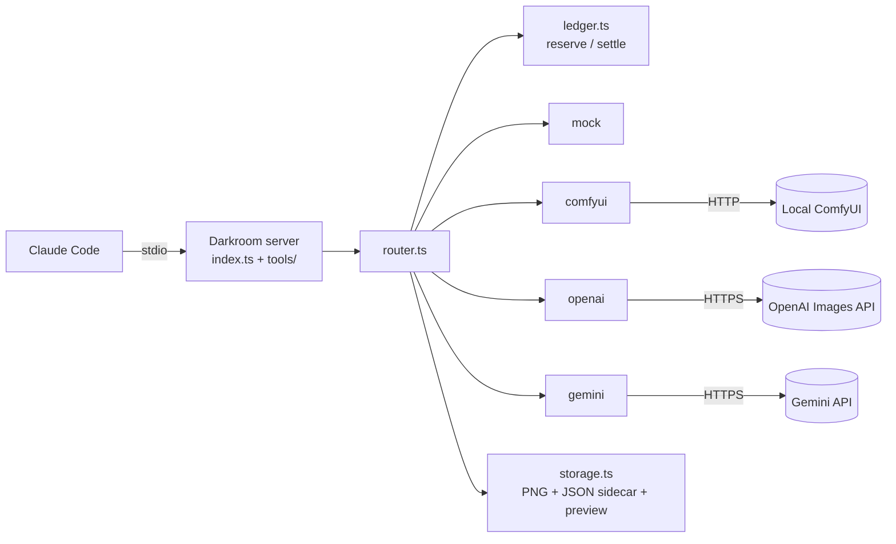

# Darkroom MCP — Goals & Build Spec

Oct 2, 2026 · @Matt

## Overview

Darkroom is a TypeScript MCP server that gives Claude Code an image generation tool through swappable providers: a free local model (Z-Image Turbo via ComfyUI) by default, with OpenAI and Gemini as paid options. Claude writes the prompt, calls the tool, sees the returned image, and iterates; Darkroom handles routing, fallback, spend limits, and saving files with metadata.

It is both a tool Matt will actually use and a resume project that demonstrates MCP, provider abstraction, cost guardrails, and testing discipline.

## Goals and non-goals

The v1 bar is three working tools, three providers (mock, local, one paid) behind one interface, and a published package someone else can install in under five minutes. The second paid provider lands right after v1 as its own commit, proving that adding a provider is cheap.

**Goals**

1. Generate images from Claude Code with zero per-image cost by default, using a local model.
2. Swap providers with one config change and no code change; adding a provider means one new provider file plus one line in the provider registry.
3. Never spend money silently: paid providers are opt-in by explicit config (not by the mere presence of an API key), with a daily spend cap and a cost on every result.
4. Return the image to Claude so it can critique and refine its own output.
5. Ship resume-grade: tests, a small eval report, a README with a demo GIF, and an npm package.
6. Have fun and keep scope tight: v1 in roughly two weekends, with the second paid provider and the Flux/SDXL templates as the first post-v1 commits.

**Non-goals for v1**

- Image editing, inpainting, or image-to-image (Phase 2).
- Remote or hosted deployment (Phase 2, on AWS).
- A web UI or gallery.
- Training or fine-tuning models.
- Calling Claude from inside the server; Claude is the client, not a dependency.

## Architecture



Claude Code talks to Darkroom over stdio. The router sends each request to the first eligible, healthy provider in the configured order, reserving estimated spend in the ledger before any paid call; storage then saves the PNG and its sidecar and returns a preview Claude can see. Providers never call each other or the router; each is one file behind the `ImageProvider` interface.

## MCP tools

v1 exposes exactly three tools; anything more waits for Phase 2.

| Tool | Inputs | Returns |
| --- | --- | --- |
| `generate_image` | `prompt` (required), `negative_prompt`, `aspect_ratio` (enum: `1:1` default, `3:2`, `2:3`, `16:9`, `9:16`), `quality` (enum: `draft` default, `final`), `provider` (optional override), `seed`, `filename` | An MCP image content block (a downscaled JPEG preview, max 768px on the long edge, for Claude to see) plus text and `structuredContent` with the absolute file path, provider, model, actual pixel size, seed (or null), latency in ms, cost in USD (actual when the provider reports it, otherwise the estimate), ignored parameters, and any skipped providers with reasons |
| `list_providers` | none | Each provider's name, model, enabled/healthy status, whether it costs money, estimated cost per image, and today's spend vs. the cap |
| `list_images` | `limit` (default 20), `provider` filter | Recent generations from the metadata sidecars: path, prompt, provider, timestamp, cost |

`list_providers` and `list_images` are annotated `readOnlyHint: true`. `generate_image` declares an `outputSchema` for its structured content.

Every saved image gets a JSON sidecar next to it (`image.png` + `image.json`) holding the full request, the resolved provider and model, actual size, seed, latency, cost, and timestamp. Filenames never overwrite: a short unique id is always appended to the sanitized slug.

`quality` controls the size tier, as a pixel budget rather than a short edge. `draft` renders about 0.25 megapixels (512×512, or 688×384 at 16:9; about 1.5 minutes locally on a 16GB M3); `final` renders about 1 megapixel (1024×1024, or 1360×768 at 16:9; about 3.5 minutes locally). Diffusion models are trained near 1MP, and time and memory scale with pixel count, so a wide `final` costs about what a square one does. Claude should iterate on drafts and render `final` once the composition is right, re-using the draft's seed where the provider supports it. Paid providers may map both tiers to their cheapest size or to a quality setting; each provider documents its mapping.

Tool descriptions must be written for the model: say when to use the tool, that local generation is the default, that local generation is slow (minutes, not seconds) so drafts come first, that with the default local model a new seed gives nearly the same picture so variety comes from rewording the prompt, that results come back as viewable images, and that **`provider` should only be passed when the user explicitly asks for a specific provider, because some providers cost money.**

## Providers

v1 ships three providers, each a single file implementing the `ImageProvider` interface: `mock`, `comfyui`, and one paid provider (pick OpenAI or Gemini at M2). The other paid provider follows immediately after v1. Model names and prices below are starting points; the agent must verify them against current provider docs before coding, and all of them live in config, not code.

| Provider | Cost | How it works | Notes |
| --- | --- | --- | --- |
| `comfyui` (default) | Free | HTTP to a local ComfyUI server: POST a workflow JSON to `/prompt`, poll `/history/{id}`, fetch bytes from `/view` | Ship one Z-Image Turbo template (GGUF, via the ComfyUI-GGUF plugin) in `workflows/`; Flux schnell and SDXL templates follow post-v1. Inject prompt, size, and seed by locating nodes through a small mapping file next to each template, not by hard-coded node ID. The mapping file also lists the template's model filenames, so the health check can verify each one exists. Exact files, sources, and timings are in "Local model spike results" below. Slow on Apple Silicon: default timeout 300s, configurable. |
| `openai` | Paid, about $0.04 to $0.17 per image depending on quality; token-billed, so record actual usage from the response | OpenAI Images API with a gpt-image model | Best typography and instruction following. Fixed set of supported sizes; no seed. |
| `gemini` | Paid, about $0.04 to $0.07 per image; token-billed, so record actual usage from the response | Gemini API with a Flash Image model | Cheapest paid option. Google's image API had no free tier as of early 2026; do not assume one. Sizes are set by aspect ratio, not pixels. Send the key in the `x-goog-api-key` header, never as a `?key=` query param, so it can't leak via URLs in errors. |
| `mock` | Free | Generates a placeholder PNG (prompt text and seed drawn on a colored background, color derived from the seed) with no network | Used in tests and CI, and for demoing without a GPU or keys. Text rendering depends on system fonts, so tests assert on dimensions and format, never on image bytes or hashes. |

The interface:

```typescript
type AspectRatio = "1:1" | "3:2" | "2:3" | "16:9" | "9:16";

interface ImageProvider {
  name: string;
  isPaid: boolean;
  supports: { negativePrompt: boolean; seed: boolean };
  estimateCostUsd(req: GenerateRequest): number;
  healthCheck(): Promise<{ ok: boolean; detail?: string }>;
  // Maps aspectRatio to the nearest size the provider supports.
  generate(req: GenerateRequest, signal: AbortSignal): Promise<GenerateResult>;
}

interface GenerateResult {
  png: Buffer;              // normalized to PNG via sharp
  model: string;
  width: number;            // actual output size
  height: number;
  seed: number | null;      // null when the provider has no seed control
  actualCostUsd?: number;   // from provider usage data, when available
}

class ContentRefusedError extends Error {} // policy refusal; never triggers fallback
```

Health checks are cheap and free: `comfyui` hits `/system_stats`, then uses `/object_info` to confirm every model file in the template's mapping is present and every node the template uses exists (for example, that the GGUF plugin is installed); paid providers check only that the provider is enabled and its key is present (no network call).

## Routing, fallback and spend cap

The router's one hard rule: **it never sends a request to a paid provider unless that provider is explicitly enabled, and it never moves from a free provider to a paid one unless the user has explicitly allowed it.** This applies to every step down the provider list, whatever the reason: a failure, a timeout, or a provider skipped as unhealthy.

A paid provider is **enabled** only when its Darkroom-specific key (`DARKROOM_OPENAI_API_KEY` / `DARKROOM_GEMINI_API_KEY`) is set **and** it appears in `DARKROOM_PROVIDER_ORDER`. A generic `OPENAI_API_KEY` in the user's shell does nothing.

For each `generate_image` call, the router:

1. If `provider` is given, uses only that provider (no fallback). It must be enabled; an explicit paid choice still goes through the cap check.
2. Otherwise walks `DARKROOM_PROVIDER_ORDER` (default `comfyui`) in order. A provider is eligible if it's enabled, healthy (health check cached for 60s), and, when it's paid and a free provider earlier in the order was skipped or failed, `DARKROOM_ALLOW_PAID_FALLBACK=true`. `DARKROOM_ALLOW_PAID_FALLBACK` only unlocks paid providers already in the order; it never adds providers.
3. Before any paid call, atomically reserves the estimated cost in the ledger; refuses with a clear error if the reservation would exceed `DARKROOM_DAILY_CAP_USD` (default $2.00). After the call, settles the reservation to the actual cost if the provider reports one. If a paid call fails ambiguously (timeout, dropped connection), the reservation stands, on the assumption that the provider may have charged.
4. On failure or timeout, aborts the provider's work (for ComfyUI, call `/interrupt` or delete the queued prompt so the GPU stops) and tries the next eligible provider. A `ContentRefusedError` is returned to Claude immediately and never falls back, so a refused prompt is never shopped to another provider.
5. Reports in the result which provider actually served the request and why any were skipped, so a fallback is never silent.

Spend is tracked in a small JSON ledger in the output directory, keyed by UTC date (the README notes that the day rolls over at UTC midnight, not local midnight). Writes are atomic (write to a temp file, then rename) and guarded by an in-process mutex, because Claude Code can issue parallel tool calls and each Claude Code session runs its own server process. A small cross-process race between concurrent sessions is accepted for v1 and documented. The `mock` provider never counts toward spend and is never chosen for a real request unless it is explicitly listed in the order.

## Timeouts and progress

Local generation takes minutes, not seconds: in the spike, every 1024px local run took 2.5 to 3.7 minutes, and even 512px drafts took about 1.5 minutes. That is longer than typical MCP client request timeouts (verify the MCP TypeScript SDK client default and Claude Code's MCP tool timeout during M1). Progress notifications are therefore **required, not optional**: while a provider is working, `generate_image` sends MCP progress notifications (for ComfyUI, on each `/history` poll, ideally carrying the sampler's step count from ComfyUI's websocket or queue status) so clients that reset their timeout on progress don't give up. If Claude Code turns out not to reset its timeout on progress, the README documents the env var that raises it. Each provider has its own configurable timeout. The ComfyUI timeout includes time spent waiting in ComfyUI's queue, since it runs one job at a time.

## Configuration and security

All configuration comes from environment variables, validated with zod at startup; the server fails fast with a readable message if anything is invalid.

| Variable | Required | Default | Purpose |
| --- | --- | --- | --- |
| `DARKROOM_OUTPUT_DIR` | No | `~/.darkroom/images` (resolved from the home directory) | Absolute path for images, sidecars, and the spend ledger. Relative paths are rejected, because the server's working directory depends on the client. |
| `DARKROOM_PROVIDER_ORDER` | No | `comfyui` | Comma-separated priority list. Paid providers must be listed here to be enabled. |
| `DARKROOM_DAILY_CAP_USD` | No | `2.00` | Daily paid-spend ceiling |
| `DARKROOM_ALLOW_PAID_FALLBACK` | No | `false` | Lets the router fall from free to paid providers already in the order |
| `COMFYUI_URL` | No | `http://127.0.0.1:8188` | Local ComfyUI server |
| `COMFYUI_WORKFLOW` | No | `zimage` | Which template in `workflows/` to use |
| `COMFYUI_TIMEOUT_MS` | No | `300000` | Per-request timeout including queue wait |
| `DARKROOM_OPENAI_API_KEY`, `DARKROOM_GEMINI_API_KEY` | No | none | Darkroom-specific keys; a paid provider needs its key **and** a place in the order |

Security requirements:

- Never log or return API keys; redact them from error messages. Send keys in headers, never in URLs.
- Sanitize `filename` to a safe slug, append a unique id, and resolve every write (via `realpath`) inside `DARKROOM_OUTPUT_DIR`; reject path traversal and symlink escapes.
- Cap prompt length (4,000 characters).
- Log to stderr only, since stdout is the MCP stdio channel.
- README documents keeping keys out of `~/.claude.json`, for example by launching Claude Code through a secret manager.

## Packaging

- `workflows/` is listed in `package.json` `files` and loaded relative to the module (`import.meta.url`), never relative to the working directory, so `npx` installs work.
- sharp ships prebuilt native binaries; confirm `npx` install time on a clean machine fits the five-minute goal.

## Testing and eval

The full test suite must pass in CI with no GPU, no network, and no API keys; that is what the `mock` provider is for.

**Tests (vitest)**

- Unit: router order, health-check skipping, **paid gating on every step down the list (failure, timeout, and unhealthy skip)**, explicit-provider behavior, enablement rules (generic `OPENAI_API_KEY` ignored), refusal-does-not-fall-back, spend reservation under parallel calls, cap math and ledger rollover at UTC midnight, filename sanitizing and path traversal rejection, aspect-ratio mapping per provider, config validation.
- Provider contract: one shared test suite every provider must pass, run against `mock` always and against real providers only when an env flag and key are set.
- Recorded fixtures: capture one real response per paid provider and the ComfyUI `/prompt` → `/history` → `/view` sequence, so parsing is tested offline. Replace image data with a tiny PNG and strip headers before committing.
- Integration: spawn the server over stdio with the MCP SDK client, call all three tools, and assert on the returned content blocks and structured content.
- Manual smoke test with the MCP Inspector, documented in the README.

**Eval (`npm run eval`)**

A fixed set of 10 prompts covering text rendering, people, objects, a UI icon, and a scene, run against every enabled provider. Paid runs go through the ledger with their own budget (`DARKROOM_EVAL_BUDGET_USD`, separate from the daily cap, since 10 prompts across two paid providers at high quality can exceed $2). Results are cached by (prompt, provider, model), so rerunning to rebuild the report doesn't spend again. It writes `eval/report.md` with a thumbnail grid plus latency and cost per provider. No automatic quality scoring in v1: the grid is for a human to judge, and the report doubles as the README's comparison section.

## Local model spike results (Oct 2, 2026)

Before writing provider code, we installed ComfyUI on Matt's machine and timed three candidate models through the same `/prompt` → `/history` → `/view` HTTP flow the `comfyui` provider will use.

**Setup:** MacBook with Apple M3, 16GB unified memory, about 11GB free (other apps closed). ComfyUI 0.38.0 from git, its own Python 3.12 venv via `uv` (Homebrew's Python 3.14 was avoided as too new for PyTorch), PyTorch 2.14.1 on MPS, ComfyUI-GGUF plugin. Prompt: a ceramic mug on a desk by a window with "DARKROOM" printed on it (tests text rendering). Each model ran on a freshly started server, twice (seeds 42 and 7).

| | SDXL base 1.0 | Flux.1 schnell (GGUF Q4_K_S) | Z-Image Turbo (GGUF Q4_K_M) |
| --- | --- | --- | --- |
| Steps | 25 (dpmpp_2m, karras, cfg 7) | 4 (euler, simple, cfg 1) | 8 (res_multistep, simple, cfg 1, shift 3) |
| 1024×1024, run 1 / run 2 | 173s / 153s | 164s / 150s | 221s / 221s |
| Seconds per step | ~6 | ~36 | ~26 |
| Peak memory (whole GB only) | ~12GB | ~12GB | ~11–12GB |
| Spelled "DARKROOM" | No, 0/2 ("IARKIDOM", "DarKoom") | Yes, 2/2, but wrapped around the mug and cut off | Yes, 2/2, clean and centered |
| Download | 6.9GB | ~9.5GB | ~7.5GB |
| License | CreativeML Open RAIL++-M | Apache 2.0 | Apache 2.0 |

Z-Image Turbo at smaller sizes (measured in an earlier round with less free memory, so read these as upper bounds): **768px in 153s, 512px in 98s**, with lettering still correct at 512. Time shrinks far less than the pixel count, because a fixed cost on each step (probably unpacking the GGUF weights on MPS) dominates.

**Decision:** Z-Image Turbo is the v1 default for its text rendering and composition. Flux schnell is about 30% faster per image and is the first post-v1 template; switch the default to it if speed matters more than lettering in practice.

**Findings that changed the spec:**

- Every local 1024px image took 2.5 to 3.7 minutes. Hence the 300s default timeout, required progress notifications, and the `quality: draft | final` tier.
- At 16GB, the full-size Flux and Z-Image weights don't fit; GGUF builds and the ComfyUI-GGUF plugin are required. The README calls out 16GB as the minimum and recommends closing other apps.
- Black Forest Labs' official Flux VAE (`ae.safetensors`) is gated behind a Hugging Face login. The identical file (same size and hash on every copy checked) is published ungated by Comfy-Org; the README links that copy.
- On a fresh server, the text encoder runs on the CPU, and models reload between prompts when memory is tight, so the "second run" was often barely faster than the first. Don't promise a warm-cache speedup.
- Background disk and network activity (model downloads) slowed Flux by about 30% in the first round. The eval should run on an otherwise idle machine.
- **Z-Image Turbo barely varies by seed.** Seeds 42 and 7 produced nearly the same mug, angle, and window; Flux and SDXL varied far more. For Z-Image, changing the seed is not a useful way to explore; changing the prompt is. The tool description says so, and `list_providers` can expose a per-template `seedVariety: low | high` hint.
- The 512px draft kept the composition and lettering of the 1024px render, which supports the draft → final workflow.
- Comparison sheet and full-size images: `~/ComfyUI/output/darkroom_spike/` (outside the repo). Re-run with `scripts/bench-comfyui.py`.

**Not yet tried:** Z-Image Q8_0 GGUF (7.2GB). It may be faster per step because Q8 is cheaper to unpack, but it could push peak memory toward 14GB.

**Model files used** (all ungated, in `~/ComfyUI/models/`):

| Folder | File | Source |
| --- | --- | --- |
| `unet/` | `z_image_turbo-Q4_K_M.gguf` | `huggingface.co/jayn7/Z-Image-Turbo-GGUF` |
| `clip/` | `Qwen3-4B-Q4_K_M.gguf` (loader type `lumina2`) | `huggingface.co/unsloth/Qwen3-4B-GGUF` |
| `vae/` | `flux_ae.safetensors` (shared by Z-Image and Flux) | `huggingface.co/Comfy-Org/z_image_turbo`, `split_files/vae/ae.safetensors` |
| `unet/` | `flux1-schnell-Q4_K_S.gguf` | `huggingface.co/city96/FLUX.1-schnell-gguf` |
| `clip/` | `t5-v1_1-xxl-encoder-Q4_K_M.gguf`, `clip_l.safetensors` | `huggingface.co/city96/t5-v1_1-xxl-encoder-gguf`, `huggingface.co/comfyanonymous/flux_text_encoders` |
| `checkpoints/` | `sd_xl_base_1.0.safetensors` | `huggingface.co/stabilityai/stable-diffusion-xl-base-1.0` |

## Milestones and acceptance criteria

Five milestones, each ending in a commit Matt can review; the agent stops after each one for a check-in rather than running ahead.

1. **M0: Scaffold and mock.** Repo, TypeScript strict, lint, vitest, CI, config validation, and the `mock` provider behind `generate_image`.
   - Done when: `claude mcp add` registers the server with `DARKROOM_PROVIDER_ORDER=mock` and Claude Code returns a placeholder image it can see. Measure the preview's payload size against Claude Code's MCP output limit.
2. **M1: Local generation.** The `comfyui` provider with the Z-Image Turbo template, node mapping, `quality` tiers, timeouts, cancellation, progress notifications, and health checks.
   - Done when: a real Z-Image `final` image is generated from Claude Code at zero cost, saved with its sidecar, without hitting a client timeout; and a health check with the GGUF plugin removed reports a clear, actionable error.
3. **M2: Ledger and the first paid provider.** The spend ledger (reserve/settle), daily cap, enablement rules, cost reporting, then one paid provider and the provider contract suite. The cap exists before the first paid call is made.
   - Done when: the same prompt and aspect ratio run on mock, comfyui, and the paid provider by changing only `provider`, and a paid request over the cap is refused.
4. **M3: Router and guardrails.** Provider order, fallback, paid gating on every step down the list, refusal handling, `list_providers` and `list_images`.
   - Done when: with ComfyUI stopped and order `comfyui,<paid>`, requests fail clearly by default (unhealthy skip does not reach the paid provider) and fall back to the paid provider only with the flag set; a generic `OPENAI_API_KEY` alone enables nothing.
5. **M4: Ship it.** Eval run and report, README (setup for each provider, config table, architecture diagram, demo GIF of Claude generating, critiquing, and regenerating), npm publish.
   - Done when: a fresh machine can install it with one `claude mcp add ... -e DARKROOM_PROVIDER_ORDER=mock -- npx ...` command and generate a mock image in under five minutes.

**Immediately after v1:** add the second paid provider as a single, self-contained commit (the "one file plus one registry line" demo), then the Flux schnell and SDXL templates.

## Phase 2 stretch goals

None of these start until v1 is published; pick one at a time.

- **Accessibility metadata.** A `save_alt_text` tool so Claude, which can already see the image, writes alt text into the sidecar; plus a contrast check of the image's dominant colors against supplied text colors (WCAG 2.2 AA ratios).
- **Image-to-image and editing.** An optional `reference_image` input on providers that support it.
- **Remote deployment on AWS.** Streamable HTTP transport, Lambda or ECS behind API Gateway, Cognito OAuth, and S3 for images, with local ComfyUI dropped or reached over a tunnel.
- **Prompt presets.** Named styles (icon, hero image, diagram-style illustration) that expand into tuned prompts per provider.

## Instructions for the coding agent

Build milestone by milestone and stop for review after each; do not start Phase 2.

- Before writing provider code, check current docs for the MCP TypeScript SDK, the OpenAI Images API, the Gemini image API, and the ComfyUI HTTP API. Model names, parameters, supported sizes, seed support, and prices change; update this spec's config defaults if they have.
- Stack: Node 22+ (Node 20 reached end-of-life in April 2026), TypeScript strict, `@modelcontextprotocol/sdk`, zod, vitest, sharp (for previews and the mock PNG). Ask before adding any other runtime dependency.
- Keep providers isolated: no provider-specific logic in the router or tools.
- Small commits with clear messages, one milestone per PR or tagged commit, so the history tells the story in an interview.
- When a spec decision turns out wrong, propose the change in a short note rather than silently diverging.
- Write the README as you go, not at the end.

Suggested repo layout:

```text
darkroom-mcp/
  src/
    index.ts          # MCP server, stdio transport, tool registration
    config.ts         # env parsing and validation (zod)
    router.ts         # provider order, health, eligibility, fallback, cap checks
    ledger.ts         # daily spend tracking (reserve / settle, atomic writes)
    storage.ts        # safe paths, PNG + JSON sidecar writes, previews
    tools/            # generate-image.ts, list-providers.ts, list-images.ts
    providers/        # types.ts, registry.ts, comfyui.ts, openai.ts, gemini.ts, mock.ts
  workflows/          # zimage.json + zimage.map.json (ComfyUI API-format template; node + model-file mapping)
  test/               # unit, contract, integration, fixtures/
  eval/               # prompts.json, run.ts, report.md
  README.md
```

## Review notes (Oct 2, 2026)

Changes from the original draft, each fixing an issue found in a stress test:

1. **Paid-gate hole on unhealthy skip.** The original only gated paid providers "on failure or timeout," so a ComfyUI health-check failure let the router reach a paid provider with the flag off. Gating now applies to every step down the list.
2. **Claude could choose a paid provider on its own** via the `provider` argument. Tool descriptions now say to pass it only on user request; explicit choices still hit the cap.
3. **A key's presence isn't consent.** Many developers export `OPENAI_API_KEY` globally. Paid providers now need a Darkroom-specific key and a place in the order.
4. **`DARKROOM_ALLOW_PAID_FALLBACK` was undefined** with the default order (`comfyui` only, nothing to fall back to). It now only unlocks paid providers already in the order.
5. **M2 spent money before M3 built the cap.** The ledger and cap now land in M2, before the first paid call.
6. **Ledger races.** Parallel tool calls and multiple sessions could both pass the cap check. Added reserve/settle, an in-process mutex, and atomic writes; the cross-process race is documented.
7. **Estimate vs. actual.** OpenAI and Gemini bill by tokens; record actual cost when reported, and keep the reservation on ambiguous failures.
8. **The eval could exceed the daily cap** (about $2.10 at high quality across two paid providers). It now has its own budget and caches results.
9. **`width`/`height` didn't fit every provider** (fixed OpenAI sizes, Gemini aspect ratios, Flux multiples of 16). Replaced with `aspect_ratio`; the result reports the actual size.
10. **`seed` and `negative_prompt` aren't universal.** Seed is nullable; providers declare `supports`, and the result lists ignored parameters.
11. **Refusals shouldn't fall back.** Added `ContentRefusedError`, so a refused prompt is never shopped to another (possibly paid) provider.
12. **Timeouts.** 180s local generation may exceed MCP client timeouts. Added progress notifications, per-provider timeouts, and real cancellation of ComfyUI jobs so the GPU stops before a fallback runs.
13. **ComfyUI fragility.** Checkpoint filename is now configurable, the health check verifies the model exists, and nodes are found by mapping file instead of hard-coded IDs.
14. **The five-minute install failed twice by default** (required output dir, default order `comfyui`). The output dir now has a default, and the install command sets `DARKROOM_PROVIDER_ORDER=mock`. M0 also needs `mock` in the order.
15. **Packaging.** `workflows/` must be in `package.json` `files` and loaded via `import.meta.url`.
16. **Mock determinism.** Font rendering differs across machines; tests assert on dimensions and format, not bytes.
17. **Smaller fixes:** Gemini key in a header, not the URL; filenames never overwrite; fixtures trimmed; JPEG previews checked against the MCP output limit; `structuredContent` and read-only annotations; dropped the 2048px dimension cap (aspect-ratio presets replace free-form sizes); text diagram replaces the embedded one a coding agent can't see.
18. **Scope.** Two weekends didn't fit four providers and two templates. v1 is now mock + comfyui (Flux) + one paid provider; the second paid provider and SDXL follow right after v1, and the second provider's commit doubles as the "adding a provider is one file" demo.
