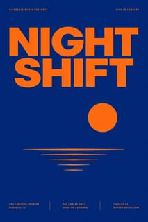
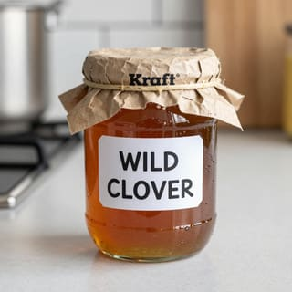
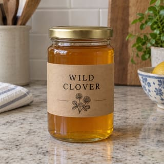
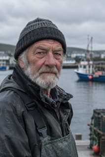
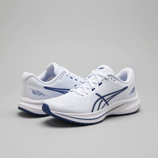
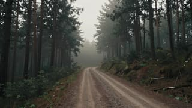
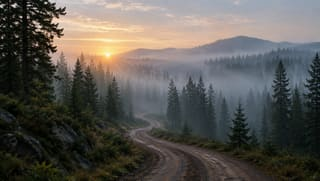

# Darkroom eval

Generated by `npm run eval` on 2026-10-03: 10 prompts at `final` quality, each run once per provider. There's no automatic scoring; the grid is for a person to judge. Latency is the full request as Darkroom saw it (for ComfyUI, including model loading). Results are cached, so rebuilding this report doesn't generate or spend again. Prompts are in `eval/prompts.json`.

## Summary

| Provider | Model | Images | Median latency | Total cost | Cost per image |
| --- | --- | --- | --- | --- | --- |
| `comfyui` | `z-image-turbo-q4_k_m` | 10 of 10 | 4m 06s | $0 (free) | $0 |
| `openai` | `gpt-image-2.5-flare` | 10 of 10 | 9.2s | $0.10 | $0.01 |

## Results

| Prompt | `comfyui` | `openai` |
| --- | --- | --- |
| **bakery-sign** (text, 3:2) a hand-painted wooden sign outside a bakery that reads FRESH BREAD DAILY, warm afternoon light |  1248×832 · 4m 22s · $0 |  1248×832 · 10.7s · $0.0089 |
| **concert-poster** (text, 2:3) a minimalist concert poster with the words NIGHT SHIFT in bold sans-serif type, deep blue and orange |  832×1248 · 3m 50s · $0 |  832×1248 · 9.3s · $0.0089 |
| **honey-jar** (text, 1:1) a glass jar of honey with a kraft paper label that reads WILD CLOVER, on a kitchen counter |  1024×1024 · 3m 50s · $0 |  1024×1024 · 9.2s · $0.0133 |
| **fisherman-portrait** (people, 2:3) a portrait of an elderly fisherman with a weathered face and a knit cap, overcast harbor behind him, 85mm photo |  832×1248 · 3m 57s · $0 |  832×1248 · 10.2s · $0.0089 |
| **cafe-friends** (people, 3:2) three friends laughing around a small cafe table, holding coffee cups, candid street photography, natural light |  1248×832 · 4m 02s · $0 |  1248×832 · 8.3s · $0.0089 |
| **running-shoes** (object, 1:1) a pair of white running shoes on a pale gray background, studio product photo, soft shadow |  1024×1024 · 4m 12s · $0 |  1024×1024 · 8.6s · $0.0133 |
| **camera-knolling** (object, 3:2) a vintage film camera taken apart, its parts laid out neatly in rows on a green cutting mat, top-down photo |  1248×832 · 4m 06s · $0 |  1248×832 · 10.9s · $0.0089 |
| **aperture-icon** (icon, 1:1) a flat app icon of a camera aperture, rounded square, purple-to-orange gradient, no text |  1024×1024 · 4m 10s · $0 |  1024×1024 · 8.9s · $0.0133 |
| **forest-road** (scene, 16:9) a misty pine forest at dawn with a winding dirt road, cinematic wide shot |  1360×768 · 4m 06s · $0 |  1360×768 · 8.6s · $0.0078 |
| **rainy-street** (scene, 9:16) a rainy neon-lit street in Tokyo at night, reflections on wet pavement, a lone figure with an umbrella |  768×1360 · 4m 15s · $0 |  768×1360 · 10.1s · $0.0078 |
